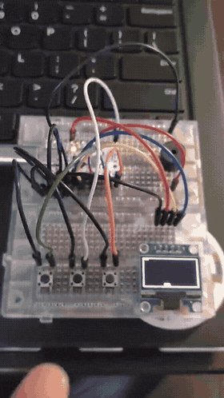
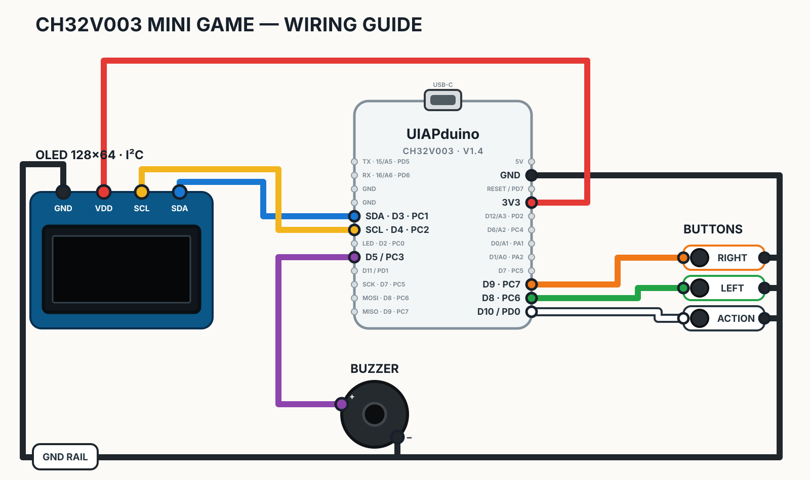

# CH32V003 Mini Game / CH32V003 ミニゲーム

A small dodge game for the UIAPduino Pro Micro CH32V003 V1.4, a 128×64 I2C
OLED, three buttons, and a small speaker. / UIAPduino Pro Micro CH32V003 V1.4、
128×64 I2C OLED、3 個のボタン、小型スピーカーで動く落下物よけゲームです。

Tested on hardware with Arduino IDE 2.3.10 and UIAPduino core 1.0.42. /
Arduino IDE 2.3.10、UIAPduino core 1.0.42 で実機確認済みです。

# Controls / 操作

- LEFT / RIGHT: move / 左右移動
- ACTION: start or restart / 開始・再開

Avoid the falling objects; the game speeds up as the score increases. /
落下物を避けます。得点が増えると落下速度が上がります。

# Example Parts / 部品購入例

Buy the UIAPduino separately, then use one Akizuki cart for most of the rest. /
UIAPduino は別に購入し、それ以外の主な部品は秋月電子のカートでまとめて揃えます。

| Store / 購入先 | Part / 部品 | Qty / 数量 |
| --- | --- | ---: |
| Switch Science | [UIAPduino Pro Micro CH32V003 V1.4](https://www.switch-science.com/products/9914) | 1 |
| 秋月電子 | [CH32V003 Mini Game parts / 部品一式](https://akizukidenshi.com/catalog/cart/cart.aspx?crsirefo_hidden=c1493df253cf9e97efe85807dd620527b3c7f2316a55538d34f7835ccae39b3c&goods=112031&qty=1&goods=103647&qty=3&goods=100315&qty=2&goods=131880&qty=1&goods=100167&qty=1&goods=110129&qty=1) | 1 set / 一式 |

The Akizuki cart contains OLED ×1, tact switch ×3, speaker ×1, EIC-801
breadboard ×2, 10 cm male-to-male jumper wires ×1, and 40-pin header ×1. /
秋月電子のカートには OLED ×1、タクトスイッチ ×3、スピーカー ×1、
EIC-801 ブレッドボード ×2、10 cm オスオスジャンパーワイヤー ×1、
40 ピンヘッダー ×1 が入ります。

If your UIAPduino has no pins yet, choose one of these: /
UIAPduino にピンがまだ付いていない場合は、次のどちらかを選びます。

- **Pin header / ピンヘッダー:** included in the Akizuki cart; cut two 12-pin rows and solder them to the UIAPduino. /
  秋月電子のカートに含まれます。12 ピンを 2 本切り出し、UIAPduino にはんだ付けします。
- **Conthrough / コンスルー:** use [高さ 2 mm のコンスルー 20 ピン](https://www.switch-science.com/products/7447)
  ×2 instead of the pin header; cut each to 12 pins and fit them to the UIAPduino. /
  ピンヘッダーの代わりに [高さ 2 mm のコンスルー 20 ピン](https://www.switch-science.com/products/7447)
  を 2 本使います。それぞれ 12 ピンに切って UIAPduino に取り付けます。

You will also need a USB Type-C **data** cable. /
USB Type-C **データ通信対応**ケーブルも用意します。

# Wiring / 配線

Connect all GND points together. Each button connects its GPIO directly to GND;
the firmware uses internal pull-ups, so no resistors are needed. /
すべての GND を共通にします。各ボタンは GPIO と GND の間に接続し、内部プルアップを
使用するため外付け抵抗は不要です。

# Build and Upload / コンパイルと書き込み

1. Add the UIAPduino Boards Manager URL
   `https://github.com/YuukiUmeta-UIAP/board_manager_files/raw/main/package_uiap.jp_index.json`
   to Arduino IDE and install the UIAPduino package. /
   この URL を Arduino IDE に追加し、UIAPduino パッケージをインストールします。
2. Select **Tools > Board > UIAPduino > Pro Micro CH32V003**. / ボードを選択します。
3. Open `firmware/ch32v003_arduino_game/ch32v003_arduino_game.ino`
   and click **Verify**. / スケッチを開いてコンパイルします。
4. Put the board into write-standby mode, click **Upload**, then reset it. /
   write-standby モードで書き込み、リセットします。

The firmware also uses `firmware/ch32v003_arduino_game/game_logic.h`; no
external OLED library is required. /
外部 OLED ライブラリは不要です。

# Startup Diagnostics / 起動時の診断

At startup, the speaker reports OLED status. /
起動時に、スピーカーで OLED の状態を知らせます。

- One short high beep: OLED detected and initialized. /
  高い短音 1 回: OLED を検出し、初期化しました。
- Three low beeps: OLED not detected. Check `3V3`, GND, SDA (`D3/PC1`), and
  SCL (`D4/PC2`). /
  低い音 3 回: OLED を検出できませんでした。`3V3`、GND、SDA (`D3/PC1`)、
  SCL (`D4/PC2`) を確認してください。
